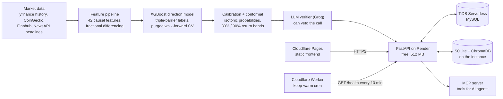

<div align="center">

# Agentic AI Finance & Stock Prediction System

**An AI-powered finance platform: a calibrated machine-learning market-prediction agent behind a full digital-wallet experience.**

</div>

<p align="center"><b><a href="https://nishanth-flux.pages.dev">Live demo: nishanth-flux.pages.dev</a></b></p>

<p align="center">
  
</p>

---

## Live demo

**[nishanth-flux.pages.dev](https://nishanth-flux.pages.dev)**

Sign in with the demo account to see the seeded portfolio, trade history and
prediction cockpit, or register your own from the sign-up page:

| | |
|---|---|
| Email | `nishanth@flux.app` |
| Password | `FluxDemo@123` |

Frontend on Cloudflare Pages, API on Render, MySQL on TiDB Serverless.

> The API runs on a free instance. If it has been idle, the first request may
> take up to a minute to wake it - the dashboard fills in once it responds.

---

FLUX unifies live market data, portfolio management, paper trading, and a
stock/crypto trend-prediction agent into a single web application.

The platform is built around an **honesty contract**: the prediction engine is
engineered to be measurably better out-of-sample than a typical tutorial
pipeline by *refusing to leak the future into training* and by *quantifying its
own uncertainty correctly* - not by promising impossible accuracy.

In practice that means purged, embargoed walk-forward cross-validation;
triple-barrier labeling; fractional differentiation tuned by ADF test;
probability calibration; GARCH-shaped conformal prediction bands; and an LLM
verifier with veto power over the model's own call.

## What it does

- **Forecasts 5-day direction** for about 30 crypto assets and US stocks, with a
  calibrated confidence and 80% / 90% price ranges that cover what they claim.
- **Checks every call against the news:** an LLM reads recent headlines and can
  lower the confidence or veto the call, and the page says why.
- **Keeps score in public:** every forecast is stored and graded when it
  matures, so the Advisor shows a real track record, not a backtest.
- **Paper trading** with a virtual wallet; the server sets the fill price and
  locks the wallet row, so the client can't trade at a made-up price.
- **Personal finance dashboard:** accounts, spending, recurring payments and a
  portfolio view, on a demo dataset that rolls forward every day.

---

## How it works



---

## Results

Daily direction is close to unpredictable. The contribution here is a leak-free
pipeline and calibrated uncertainty, not alpha.

Out-of-fold numbers from purged, embargoed walk-forward cross-validation:
133,753 predictions over 29 symbols, 5-day triple-barrier labels, data to
2026-10-03 (`backend/prediction/models/model_meta.json`).

| Model | Accuracy | AUC |
|---|---|---|
| FLUX-X (XGBoost) | 0.528 | 0.522 |
| Always-up baseline | **0.531** | - |
| Persistence (tomorrow = today) | 0.496 | - |

- **Accuracy:** the model does not beat always-up. Markets drift up, so 53% of
  the labels are UP.
- **Ranking:** AUC above 0.5 means there is a small ranking signal. On its 10%
  most confident calls the model is right 55.1% of the time (+2.0 points over
  always-up), and 56.0% on the top 5%. The meta-model's "act" filter keeps 12.8%
  of calls at 54.4% precision, versus 53.5% when acting on every call.
- **Calibration:** expected calibration error is 0.031 raw and 0.022 after
  isotonic calibration. Each walk-forward fold is scored with a calibrator fit
  only on earlier folds. An earlier version reported ~0, because it scored the
  calibrator on the same predictions it was fit on.
- **Uncertainty bands:** the 80% and 90% conformal return bands cover 80.0% and
  90.0% of outcomes out of fold.
- **Price point forecast:** the predicted 5-day return misses by 5.41% on
  average, versus 5.35% for assuming no change, so it has no skill. The Advisor
  shows the range as the headline and the central estimate greyed out.
- **Regime-conditional stack:** with every input calibrated out of sample it
  does not beat the plain model (AUC 0.536 vs 0.537), so it stays switched off.
- **ARIMA(1,0,0):** 53.1% on its own sample of 1,189 points, 1.3 points *below*
  always-up on that sample. An earlier run showed 57%. A check found no leak: on
  the same sample ARIMA agreed 95% of the time with "the sign of the trailing
  500-day average return", so that number was market drift, not forecasting skill.

---

## How the prediction agent works

- **Purged, embargoed walk-forward CV:** training rows whose labels overlap the
  test window are dropped, plus a gap after it, so no future price leaks in.
- **Triple-barrier labels:** each row is labelled by which comes first: a profit
  target, a stop, or a time limit, scaled to that asset's volatility.
- **Fractional differencing:** prices are differenced just enough to pass an ADF
  stationarity test, keeping as much memory of the level as possible.
- **Calibration:** isotonic regression maps raw scores to probabilities; it is
  evaluated only on folds it was not fitted on.
- **Conformal ranges:** 80% and 90% return bands, scaled by GARCH volatility,
  that cover 80.0% and 90.0% out of sample.
- **LLM verifier:** a separate model reads the news and can agree, downgrade or
  veto the call; its verdict is stored next to the forecast.

---

## Runs on free tiers

The whole stack runs without a payment method on file:
Cloudflare Pages (frontend), Render free (API: 512 MB, 0.1 CPU), TiDB Serverless
(MySQL), Groq (LLM) and a Cloudflare Worker that pings `/health` every 10
minutes so the API doesn't sleep.

512 MB shaped the design. PyTorch alone is 445 MB, so the deployed API uses an
LLM for sentiment instead of FinBERT, ships pre-trained models instead of
training on the server, and boots at about 120 MB. The full story, including
what broke on the way, is in [docs/DEPLOYMENT_RECORD.md](docs/DEPLOYMENT_RECORD.md).

---

## Pages

- **Dashboard:** daily briefing on the top mover, portfolio value, asset
  allocation and cashflow, from the signed-in user's own data.
- **Smart Advisor:** one verdict per asset ("BTC likely up over the next 5 days
  · 62% confidence"), the 80% price range, suggested size, track record, and the
  news check that can lower or veto the call. Other assets' forecasts below.
- **Analysis:** live candles, a spending heatmap, the paper-trade ledger and a
  strategy backtester.
- **Marketplace:** live crypto and stock quotes, a per-asset chart with RSI and
  MACD, and a paper-trading ticket; the server sets the fill price.
- **Payments:** accounts, contacts, recurring payments and a spending meter.

---

## Documentation

| Document | Purpose |
|---|---|
| [docs/SETUP.md](docs/SETUP.md) | Full local installation and run instructions |
| [docs/DEPLOYMENT.md](docs/DEPLOYMENT.md) | Deploy the full stack on free tiers |
| [docs/KEEP_WARM.md](docs/KEEP_WARM.md) | How the free-tier API is kept awake, and how to check it |
| [docs/DEPLOYMENT_RECORD.md](docs/DEPLOYMENT_RECORD.md) | What is deployed, where, and the problems hit getting there |
| [docs/FEATURES.md](docs/FEATURES.md) | Complete feature catalogue |
| [docs/PAGES.md](docs/PAGES.md) | Every frontend page and what it does |
| [docs/ARCHITECTURE.md](docs/ARCHITECTURE.md) | System architecture, modules, data flow |
| [docs/API_KEYS.md](docs/API_KEYS.md) | Every API key and setting, and what breaks without it |
| [docs/DATASETS.md](docs/DATASETS.md) | Training datasets, and which ones the served model uses |
| [docs/API_REFERENCE.md](docs/API_REFERENCE.md) | Backend HTTP endpoint reference |
| [docs/AGENT_TRAINING.md](docs/AGENT_TRAINING.md) | How the prediction agent is trained |

---

## Technology Stack

| Layer | Production (live demo) | Local development |
|---|---|---|
| Frontend | Static HTML, CSS design tokens, vanilla JS on Cloudflare Pages | `live-server` on port 3000 |
| API | FastAPI + Uvicorn in Docker on Render (free tier) | `uvicorn --reload` on port 8000 |
| Background jobs | APScheduler; a Cloudflare Worker keeps the API warm | APScheduler |
| Database | TiDB Serverless (MySQL-compatible, TLS) via `pymysql` | Local MySQL, SQLite (`aiosqlite`) for the market store |
| LLM (insights, verifier, sentiment) | Groq through an OpenAI-compatible client (`backend/llm.py`) | Ollama with a local model, or any OpenAI-compatible endpoint |
| Retrieval | ChromaDB vector store | ChromaDB |

**Prediction agent:** XGBoost, scikit-learn (calibration, linear base learners),
`hmmlearn` (regime HMM), `arch` (GARCH(1,1)), `statsmodels` (ADF test, ARIMA
baseline), plus in-house fractional differencing, triple-barrier labelling,
purged walk-forward CV and conformal bands. PyTorch (FinBERT, CryptoBERT, the
LSTM magnitude head, Chronos) is optional research tooling that the deployed
build does not install.

**Tooling:** GitHub Actions (pytest, Ruff, Docker smoke test, static build
check), Docker, Render Blueprint (`render.yaml`).

---

## Quick Start

```bash
# 1. Frontend dependencies
npm install

# 2. Backend dependencies (use a virtual environment); what production runs
pip install -r backend/requirements-slim.txt

# 3. Configure secrets - copy the template, set MySQL and any keys you have
cp .env.example .env          # Windows:  copy .env.example .env

# 4. Create and seed the MySQL database (includes the demo user)
python scripts/seed_mysql.py

# 5. Start the backend API (port 8000)
npm run api                   # or: uvicorn backend.main:app --reload --port 8000

# 6. Start the frontend (port 3000) in a second terminal
npm run dev
```

Open <http://localhost:3000> and click "Use demo account". The backend health
probe is at <http://localhost:8000/health>.

MySQL is required; every API key is optional - a missing key disables only the
feature that needs it. The trained models are committed, so forecasts work
without training. For the full walkthrough, see [docs/SETUP.md](docs/SETUP.md).

---

## Tests

Two suites: the prediction agent (feature engineering, leakage guards, the
ensemble, portfolio construction) and the API (auth guards, trading, rate
limiting, migrations, MySQL pool; the database and network are faked).

```bash
pytest backend/prediction -q
pytest backend/tests -q
```

CI runs the prediction suite on Python 3.10 and 3.12 and the API suite against
the locked slim requirements the Docker image uses, plus Ruff, a Docker
`/health` smoke test and a static-build check, on every push and pull request.

---

## Repository Layout

```
.
├── index.html              # Landing page
├── pages/                  # Application pages (dashboard, marketplace, ...)
├── css/                    # Design-token-based stylesheets
├── js/                     # Frontend JavaScript modules
├── backend/                # FastAPI application
│   ├── main.py             # App wiring, lifespan, /health
│   ├── routes/             # market, predict, ingestion, ai, backtest routers
│   ├── ingestion.py        # APScheduler ingestion jobs
│   ├── insights.py         # LLM market-insight generation
│   ├── rag.py              # ChromaDB embedding + retrieval
│   ├── db.py / mysql_db.py # SQLite + MySQL persistence
│   ├── auth.py             # Login / register / sessions
│   ├── trading_api.py      # Paper trading, watchlist, alerts
│   ├── payments_api.py     # Payments page writes
│   └── prediction/         # The machine-learning prediction agent
├── scripts/                # Seeding, dataset download, DB tools
│   └── experiments/        # Research gates: each feature had to pass these
├── Dataset/                # Training datasets (created locally, not committed)
├── ai_engine/              # Ollama model files
├── mcp/                    # Model Context Protocol server
└── docs/                   # This documentation set
```

---

## Limitations and next steps

- **Daily direction is close to a coin flip.** The model doesn't beat always-up
  on raw accuracy; its value is in the confident subset and the honest ranges.
- **The regime-switching ensemble is off:** it no longer beats the plain model
  out of sample, so serving skips it until it does.
- **Free-tier cold starts:** if the keep-warm ping misses, the first request can
  take up to a minute.
- **Models are trained offline** and committed; retraining is a manual step.
- **Next:** an edge cache for public quotes, so prices load during a cold start.

---

## Disclaimer

FLUX is a research and educational platform. The prediction agent produces
*calibrated decision support*, not financial advice or an oracle. All trading
functionality is **paper trading only**; the system never executes live trades
or moves real money. Markets are near-efficient - realistic directional
accuracy on daily bars has a hard ceiling. Do not risk capital based on this
software.

---

## License

[MIT](LICENSE) © Nishanth S
